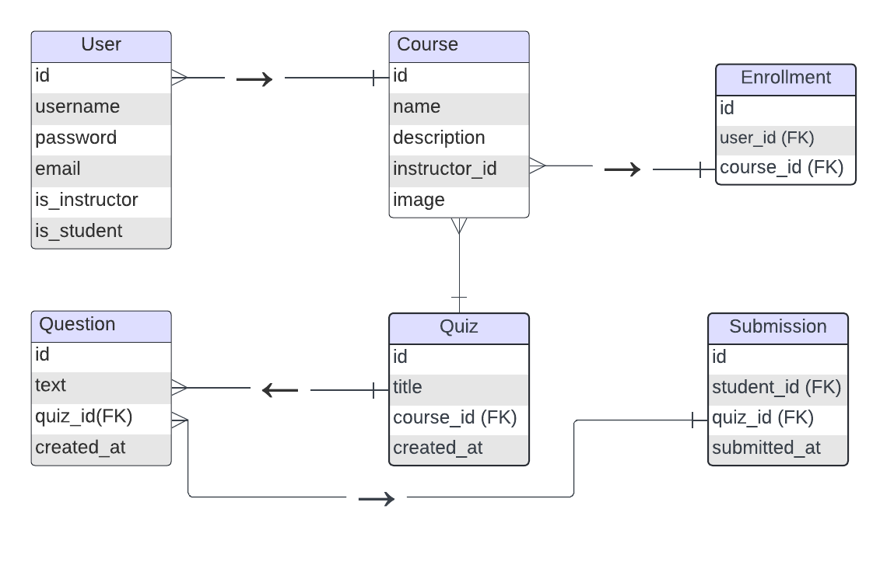

# QuizMate Models Documentation



## Table of Contents

1. [Model Overview](#model-overview)
2. [CustomUser Model](#customuser-model)
3. [Course Model](#course-model)
4. [Enrollment Model](#enrollment-model)
5. [Quiz Model](#quiz-model)
6. [Question Model](#question-model)
7. [Submission Model](#submission-model)
8. [Model Relationships](#model-relationships)
9. [Usage Examples](#usage-examples)
10. [Database Schema](#database-schema)

---

## Model Overview

The QuizMate application uses 6 main models to manage the course and quiz system:

- **CustomUser**: Extended Django user model with role-based permissions
- **Course**: Represents courses created by instructors
- **Enrollment**: Many-to-many relationship between students and courses
- **Quiz**: Quizzes belonging to courses
- **Question**: Multiple choice questions belonging to quizzes
- **Submission**: Student quiz submissions and scores

---

## CustomUser Model

**Location**: `courses/models.py:5-14`

Extends Django's `AbstractUser` to add role-based functionality for students and instructors.

### Fields

| Field | Type | Description | Constraints |
|-------|------|-------------|-------------|
| `is_student` | `BooleanField` | Indicates if user is a student | Default: `False` |
| `is_instructor` | `BooleanField` | Indicates if user is an instructor | Default: `False` |

*Inherits all fields from Django's AbstractUser: `username`, `email`, `password`, `first_name`, `last_name`, `is_active`, `date_joined`, etc.*

### Methods

#### `avg_grade()`
**Returns**: `float`
**Description**: Calculates the average grade across all student enrollments.

```python
def avg_grade(self):
    return self.enrollments.aggregate(Avg('grade'))['grade__avg'] or 0.0
```

**Usage**:
```python
student = CustomUser.objects.get(username='john_doe')
average_grade = student.avg_grade()  # Returns float, e.g., 85.5
```

#### `avg_progress()`
**Returns**: `float`
**Description**: Calculates the average progress across all student enrollments.

```python
def avg_progress(self):
    return self.enrollments.aggregate(Avg('progress'))['progress__avg'] or 0.0
```

**Usage**:
```python
student = CustomUser.objects.get(username='john_doe')
progress = student.avg_progress()  # Returns float, e.g., 75.2
```

### Related Names

- `courses`: All courses created by this instructor (if instructor)
- `enrollments`: All course enrollments for this student (if student)
- `submissions`: All quiz submissions by this student (if student)

### Example Usage

```python
# Create a student
student = CustomUser.objects.create_user(
    username='student1',
    password='password123',
    is_student=True
)

# Create an instructor
instructor = CustomUser.objects.create_user(
    username='instructor1',
    password='password123',
    is_instructor=True
)

# Get student's performance metrics
avg_grade = student.avg_grade()
avg_progress = student.avg_progress()
```

---

## Course Model

**Location**: `courses/models.py:15-20`

Represents courses created by instructors.

### Fields

| Field | Type | Description | Constraints |
|-------|------|-------------|-------------|
| `name` | `CharField` | Course name | Max length: 100 characters |
| `description` | `TextField` | Course description | No length limit |
| `instructor` | `ForeignKey` | Course instructor | References `CustomUser`, cascade delete |
| `image` | `CharField` | Course image filename/URL | Max length: 200 characters, nullable |

### Relationships

- **Many-to-One**: `instructor` → `CustomUser` (instructor)
- **One-to-Many**: `quizzes` → `Quiz`
- **Many-to-Many**: `students` through `Enrollment`

### Related Names

- `quizzes`: All quizzes belonging to this course
- `enrollments`: All student enrollments in this course

### Example Usage

```python
# Create a course
instructor = CustomUser.objects.get(username='instructor1')
course = Course.objects.create(
    name='Python Programming',
    description='Learn Python from basics to advanced',
    instructor=instructor,
    image='python.jpg'
)

# Get all courses by an instructor
instructor_courses = Course.objects.filter(instructor=instructor)

# Get enrolled students
enrolled_students = course.enrollments.all()
```

---

## Enrollment Model

**Location**: `courses/models.py:21-26`

Represents the many-to-many relationship between students and courses with additional tracking data.

### Fields

| Field | Type | Description | Constraints |
|-------|------|-------------|-------------|
| `student` | `ForeignKey` | Enrolled student | References `CustomUser`, cascade delete |
| `course` | `ForeignKey` | Enrolled course | References `Course`, cascade delete |
| `grade` | `FloatField` | Current grade in course | Default: 0.0 |
| `progress` | `FloatField` | Progress percentage | Default: 0.0 |

### Relationships

- **Many-to-One**: `student` → `CustomUser`
- **Many-to-One**: `course` → `Course`

### Example Usage

```python
# Enroll a student in a course
student = CustomUser.objects.get(username='student1')
course = Course.objects.get(name='Python Programming')

enrollment = Enrollment.objects.create(
    student=student,
    course=course,
    grade=0.0,
    progress=0.0
)

# Update student progress
enrollment.progress = 75.5
enrollment.grade = 88.2
enrollment.save()

# Get all enrollments for a student
student_enrollments = Enrollment.objects.filter(student=student)
```

---

## Quiz Model

**Location**: `courses/models.py:27-31`

Represents quizzes belonging to courses.

### Fields

| Field | Type | Description | Constraints |
|-------|------|-------------|-------------|
| `course` | `ForeignKey` | Parent course | References `Course`, cascade delete |
| `title` | `CharField` | Quiz title | Max length: 100 characters |
| `description` | `TextField` | Quiz description | No length limit |

### Relationships

- **Many-to-One**: `course` → `Course`
- **One-to-Many**: `questions` → `Question`
- **One-to-Many**: `submissions` → `Submission`

### Related Names

- `questions`: All questions in this quiz
- `submissions`: All student submissions for this quiz

### Example Usage

```python
# Create a quiz
course = Course.objects.get(name='Python Programming')
quiz = Quiz.objects.create(
    course=course,
    title='Python Basics Quiz',
    description='Test your understanding of Python fundamentals'
)

# Get all quizzes in a course
course_quizzes = Quiz.objects.filter(course=course)

# Get quiz with questions
quiz_with_questions = Quiz.objects.prefetch_related('questions').get(id=1)
```

---

## Question Model

**Location**: `courses/models.py:32-45`

Represents multiple-choice questions belonging to quizzes.

### Fields

| Field | Type | Description | Constraints |
|-------|------|-------------|-------------|
| `quiz` | `ForeignKey` | Parent quiz | References `Quiz`, cascade delete |
| `question` | `CharField` | Question text | Max length: 255 characters |
| `option1` | `CharField` | First option | Max length: 100 characters |
| `option2` | `CharField` | Second option | Max length: 100 characters |
| `option3` | `CharField` | Third option | Max length: 100 characters |
| `option4` | `CharField` | Fourth option | Max length: 100 characters |
| `correct_option` | `CharField` | Correct option number (1-4) | Max length: 100 characters, default: 'Answer' |

### Methods

#### `is_correct(selected_option)`
**Parameters**: 
- `selected_option` (str): The option selected by the student

**Returns**: `bool`
**Description**: Checks if the selected option matches the correct answer.

```python
def is_correct(self, selected_option):
    return str(self.correct_option) == str(selected_option)
```

#### `get_correct_answer()`
**Returns**: `str`
**Description**: Returns the text of the correct answer option.

```python
def get_correct_answer(self):
    return getattr(self, f'option{self.correct_option}')
```

### Example Usage

```python
# Create a question
quiz = Quiz.objects.get(title='Python Basics Quiz')
question = Question.objects.create(
    quiz=quiz,
    question='What is Python?',
    option1='A snake',
    option2='A programming language',
    option3='A movie',
    option4='A game',
    correct_option='2'
)

# Check if answer is correct
is_correct = question.is_correct('2')  # Returns True
correct_answer = question.get_correct_answer()  # Returns 'A programming language'

# Get all questions for a quiz
quiz_questions = Question.objects.filter(quiz=quiz)
```

---

## Submission Model

**Location**: `courses/models.py:47-59`

Represents student quiz submissions and scores.

### Fields

| Field | Type | Description | Constraints |
|-------|------|-------------|-------------|
| `student` | `ForeignKey` | Student who submitted | References `CustomUser`, cascade delete |
| `quiz` | `ForeignKey` | Quiz submitted | References `Quiz`, cascade delete |
| `score` | `FloatField` | Number of correct answers | No constraints |
| `total_questions` | `IntegerField` | Total questions in quiz | No constraints |
| `submitted_at` | `DateTimeField` | Submission timestamp | Auto-generated |

### Methods

#### `percentage()`
**Returns**: `float`
**Description**: Calculates the percentage score for the submission.

```python
def percentage(self):
    if self.total_questions > 0:
        return (self.score / self.total_questions) * 100
    else:
        return 0
```

### Example Usage

```python
# Create a submission
student = CustomUser.objects.get(username='student1')
quiz = Quiz.objects.get(title='Python Basics Quiz')

submission = Submission.objects.create(
    student=student,
    quiz=quiz,
    score=8.0,
    total_questions=10
)

# Calculate percentage
percentage = submission.percentage()  # Returns 80.0

# Get all submissions by a student
student_submissions = Submission.objects.filter(student=student)

# Get latest submission for a quiz
latest_submission = Submission.objects.filter(
    student=student, 
    quiz=quiz
).order_by('-submitted_at').first()
```

---

## Model Relationships

### Entity Relationship Diagram

The models have the following relationships:

```
CustomUser (1) ←→ (M) Course [instructor relationship]
CustomUser (M) ←→ (M) Course [through Enrollment]
CustomUser (1) ←→ (M) Submission
Course (1) ←→ (M) Quiz
Quiz (1) ←→ (M) Question
Quiz (1) ←→ (M) Submission
```

### Relationship Details

1. **CustomUser ↔ Course (Instructor)**
   - One instructor can create many courses
   - Each course has one instructor
   - Cascade delete: Deleting instructor deletes their courses

2. **CustomUser ↔ Course (Student via Enrollment)**
   - Many students can enroll in many courses
   - Enrollment model tracks grade and progress
   - Cascade delete: Deleting student/course deletes enrollment

3. **Course ↔ Quiz**
   - One course can have many quizzes
   - Each quiz belongs to one course
   - Cascade delete: Deleting course deletes its quizzes

4. **Quiz ↔ Question**
   - One quiz can have many questions
   - Each question belongs to one quiz
   - Cascade delete: Deleting quiz deletes its questions

5. **Quiz ↔ Submission**
   - One quiz can have many submissions
   - Each submission is for one quiz
   - Cascade delete: Deleting quiz deletes its submissions

6. **CustomUser ↔ Submission**
   - One student can have many submissions
   - Each submission belongs to one student
   - Cascade delete: Deleting student deletes their submissions

---

## Usage Examples

### Complete Course Setup

```python
# 1. Create instructor
instructor = CustomUser.objects.create_user(
    username='prof_smith',
    email='smith@university.edu',
    password='secure_password',
    is_instructor=True
)

# 2. Create course
course = Course.objects.create(
    name='Data Structures',
    description='Learn fundamental data structures',
    instructor=instructor,
    image='datastructures.jpg'
)

# 3. Create quiz
quiz = Quiz.objects.create(
    course=course,
    title='Arrays and Lists',
    description='Test your knowledge of arrays and lists'
)

# 4. Add questions
questions_data = [
    {
        'question': 'What is the time complexity of accessing an array element?',
        'option1': 'O(1)',
        'option2': 'O(n)',
        'option3': 'O(log n)',
        'option4': 'O(n²)',
        'correct_option': '1'
    },
    {
        'question': 'Which data structure uses LIFO principle?',
        'option1': 'Queue',
        'option2': 'Stack',
        'option3': 'Array',
        'option4': 'Tree',
        'correct_option': '2'
    }
]

for q_data in questions_data:
    Question.objects.create(quiz=quiz, **q_data)
```

### Student Enrollment and Quiz Taking

```python
# 1. Create student
student = CustomUser.objects.create_user(
    username='john_doe',
    email='john@student.edu',
    password='student_password',
    is_student=True
)

# 2. Enroll in course
enrollment = Enrollment.objects.create(
    student=student,
    course=course
)

# 3. Take quiz (simulate)
questions = quiz.questions.all()
correct_answers = 0
total_questions = questions.count()

for question in questions:
    # Simulate student selecting correct answer
    if question.is_correct(question.correct_option):
        correct_answers += 1

# 4. Create submission
submission = Submission.objects.create(
    student=student,
    quiz=quiz,
    score=correct_answers,
    total_questions=total_questions
)

print(f"Score: {submission.score}/{submission.total_questions}")
print(f"Percentage: {submission.percentage()}%")
```

### Analytics Queries

```python
# Get instructor's course statistics
instructor_courses = Course.objects.filter(instructor=instructor)
total_students = Enrollment.objects.filter(
    course__in=instructor_courses
).count()

# Get student performance across all courses
student_avg_grade = student.avg_grade()
student_avg_progress = student.avg_progress()

# Get quiz performance statistics
quiz_submissions = Submission.objects.filter(quiz=quiz)
avg_score = quiz_submissions.aggregate(
    avg_score=models.Avg('score')
)['avg_score']

# Get course completion rates
course_enrollments = Enrollment.objects.filter(course=course)
completed_students = course_enrollments.filter(progress=100).count()
completion_rate = (completed_students / course_enrollments.count()) * 100
```

---

## Database Schema

### Table Structure

```sql
-- CustomUser extends auth_user
CREATE TABLE courses_customuser (
    user_ptr_id INTEGER PRIMARY KEY,
    is_student BOOLEAN NOT NULL DEFAULT FALSE,
    is_instructor BOOLEAN NOT NULL DEFAULT FALSE
);

-- Course table
CREATE TABLE courses_course (
    id INTEGER PRIMARY KEY AUTOINCREMENT,
    name VARCHAR(100) NOT NULL,
    description TEXT NOT NULL,
    instructor_id INTEGER NOT NULL REFERENCES courses_customuser(user_ptr_id),
    image VARCHAR(200)
);

-- Enrollment table
CREATE TABLE courses_enrollment (
    id INTEGER PRIMARY KEY AUTOINCREMENT,
    student_id INTEGER NOT NULL REFERENCES courses_customuser(user_ptr_id),
    course_id INTEGER NOT NULL REFERENCES courses_course(id),
    grade REAL NOT NULL DEFAULT 0.0,
    progress REAL NOT NULL DEFAULT 0.0
);

-- Quiz table
CREATE TABLE courses_quiz (
    id INTEGER PRIMARY KEY AUTOINCREMENT,
    course_id INTEGER NOT NULL REFERENCES courses_course(id),
    title VARCHAR(100) NOT NULL,
    description TEXT NOT NULL
);

-- Question table
CREATE TABLE courses_question (
    id INTEGER PRIMARY KEY AUTOINCREMENT,
    quiz_id INTEGER NOT NULL REFERENCES courses_quiz(id),
    question VARCHAR(255) NOT NULL,
    option1 VARCHAR(100) NOT NULL,
    option2 VARCHAR(100) NOT NULL,
    option3 VARCHAR(100) NOT NULL,
    option4 VARCHAR(100) NOT NULL,
    correct_option VARCHAR(100) NOT NULL DEFAULT 'Answer'
);

-- Submission table
CREATE TABLE courses_submission (
    id INTEGER PRIMARY KEY AUTOINCREMENT,
    student_id INTEGER NOT NULL REFERENCES courses_customuser(user_ptr_id),
    quiz_id INTEGER NOT NULL REFERENCES courses_quiz(id),
    score REAL NOT NULL,
    total_questions INTEGER NOT NULL,
    submitted_at DATETIME NOT NULL
);
```

### Indexes

Recommended indexes for performance:

```sql
CREATE INDEX idx_course_instructor ON courses_course(instructor_id);
CREATE INDEX idx_enrollment_student ON courses_enrollment(student_id);
CREATE INDEX idx_enrollment_course ON courses_enrollment(course_id);
CREATE INDEX idx_quiz_course ON courses_quiz(course_id);
CREATE INDEX idx_question_quiz ON courses_question(quiz_id);
CREATE INDEX idx_submission_student ON courses_submission(student_id);
CREATE INDEX idx_submission_quiz ON courses_submission(quiz_id);
CREATE INDEX idx_submission_date ON courses_submission(submitted_at);
```